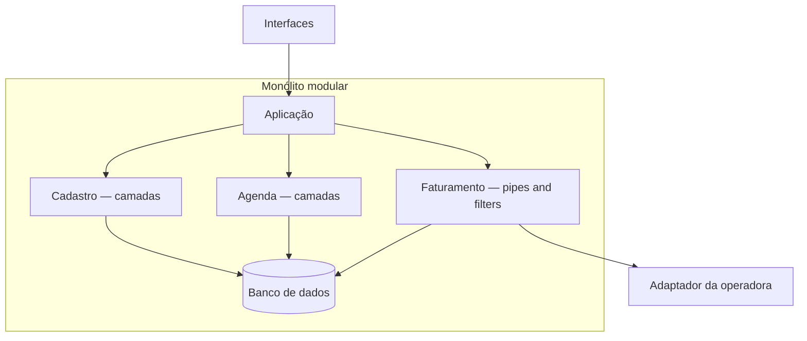

## ESTRUTURA ARQUITETURAL

A estrutura escolhida para a plataforma é um **monólito modular**, agrupando os módulos em uma única unidade de implantação, mas preservando as interfaces explícitas e a autonomia interna de cada capacidade.

**Texto alternativo:** uma aplicação de plataforma encaminha interfaces autorizadas aos módulos Cadastro, Agenda e Faturamento dentro de um monólito modular; os módulos registram dados e logs para auditoria em um banco de dados, e o faturamento se comunica com um adaptador externo da operadora, fora do quadro.

*Figura 1 — Monólito modular com estilos internos para Cadastro, Agenda e Faturamento. Fonte: adaptação do curso.*

**Leitura textual da figura:** as Interfaces chegam à Aplicação da plataforma. Dentro do quadro "Monólito modular", a aplicação encaminha para o Módulo Cadastro com estilo interno em camadas, para o Módulo Agenda com estilo interno em camadas e para o Módulo Faturamento com estilo interno em pipes and filters. Os módulos de Cadastro, Agenda e Faturamento registram dados e logs para auditoria no Banco de dados. Fora do quadro, o Módulo Faturamento conversa com o Adaptador da operadora, que é um adaptador externo.

**Relação entre módulos, estilos e cenários atendidos:**

* **Módulo Cadastro** — estilo interno em Camadas — atende ao cenário 1 de **integridade**, permitindo separar a apresentação das invariantes de negócio na camada de domínio (como a regra de unicidade do paciente).

* **Módulo Agenda** — estilo interno em Camadas — atende ao cenário 2 de **consistência** sob concorrência, protegendo as regras transacionais de conflito de horário no repositório local compartilhado pela unidade de implantação.

* **Módulo Faturamento** — estilo interno em Pipes and filters — atende ao cenário 3 de **vazão (*throughput*)**, validando, normalizando e processando lotes volumosos de registros por meio de filtros encadeados sequencialmente.